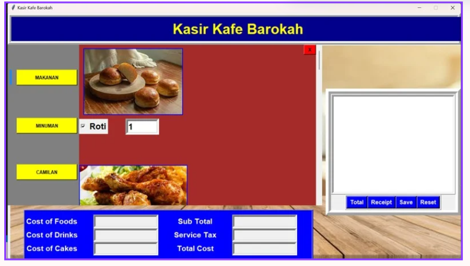
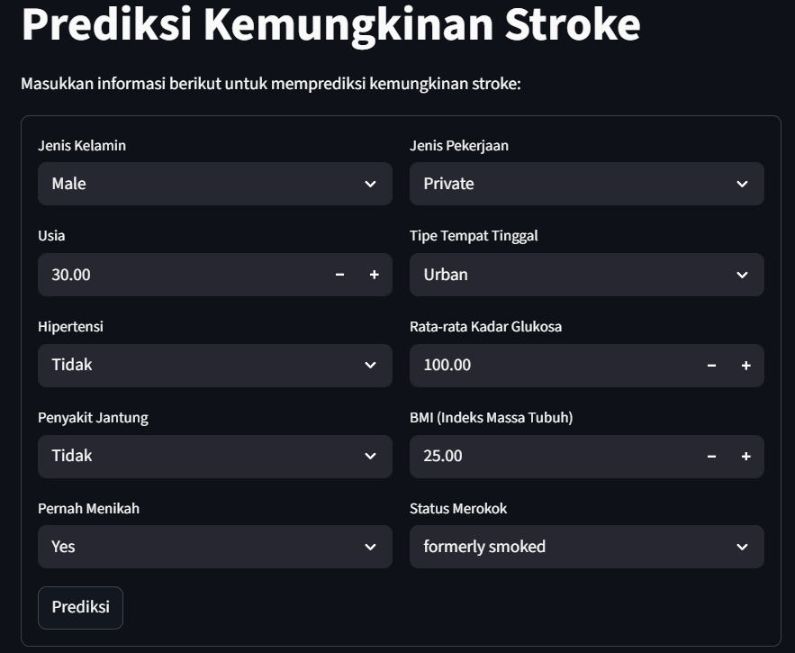

# Portofolio Laravel - Andrian Simanjuntak

Ini adalah proyek **Portofolio Pribadi** yang dibuat menggunakan **Laravel** sebagai backend dan **Tailwind CSS** sebagai frontend. Website ini menampilkan informasi tentang saya, proyek-proyek yang telah saya kerjakan, serta formulir kontak yang dapat digunakan pengunjung untuk menghubungi saya langsung.

## 🔍 Fitur Utama

- 🌐 Halaman Home dengan desain elegan
- 👨‍🎓 Sekilas tentang saya (About)
- 🧠 Daftar Proyek (Projects) dengan deskripsi dan link ke GitHub
- 📩 Formulir kontak yang terhubung ke database SQLite
- ⭐ Sistem rating sederhana untuk feedback portofolio
- 🔒 Validasi input dan keamanan dasar Laravel

## 📸 Cuplikan

| Halaman Utama | Formulir Kontak |
|---------------|-----------------|
|  |  |

## 🚀 Teknologi yang Digunakan

- **Laravel 10**
- **Tailwind CSS**
- **Blade Template Engine**
- **SQLite (Local Database)**
- **Vite for asset management**

## ⚙️ Cara Menjalankan Proyek Secara Lokal

1. Clone repo ini:
   git clone https://github.com/andrian763/portofolio-laravel-.git
   cd portofolio-laravel-
Install dependency:
composer install
npm install && npm run dev
Buat file .env dari .env.example dan sesuaikan jika perlu:
cp .env.example .env
php artisan key:generate
Jalankan migrasi:
php artisan migrate
Jalankan server lokal:
php artisan serve
Akses melalui: https://andrianportofolio.my.id/

📬 Kontak
Jika ingin terhubung atau memberikan feedback:

📧 andriansimanjuntak763@gmail.com

🌐 LinkedIn

💻 GitHub

📄 Lisensi
Proyek ini bebas digunakan untuk tujuan pembelajaran dan pengembangan pribadi.

